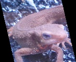
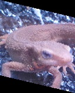
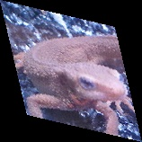
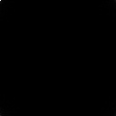
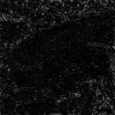
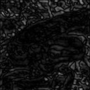
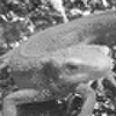
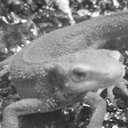

# Q. 31 - 40

## Q.31. Affine Transformation (Skew)

1. Create an X-sharing (dx = 30) image like output (1) by using affine transformation.
2. Create a Y-sharing (dy = 30) image such as output (2) by using affine transformation.
3. Create a geometrically transformed (dx = 30, dy = 30) image such as output (3) by using affine transformation.

Such an image is called a skewed image and is obtained by extending an image in an oblique direction.

In the case of output (1), the image stretched by dx in the x direction is called X-sharing.

In the case of output (2), the image stretched by dy in the y direction is called Y-sharing.

It an be realized by affine transformation of the following formulas. However, it is assumed that the size of the original image is h, x, w.

```bash
(1) X-sharing                  (2) Y-sharing
   a = dx / h                     a = dy / w

  x'       1 a tx    x           x'       1 0 tx    x
[ y' ] = [ 0 1 ty ][ y ]       [ y' ] = [ a 1 ty ][ y ]
  1        0 0  1    1           1        0 0  1    1
```

|Input (imori.jpg)|Output (1) (answer_31_1.jpg)|Output (2) (answer_31_2.jpg)|Output (3) (answer_31_3.jpg)|
|:---:|:---:|:---:|:---:|
|||||

answer >> [31_Affine_Transformation(Skew).py](./31_Affine_Transformation(Skew).py)

## Q.32. Fourier Transform

Implement two-dimensional Discrete Fourier Transform (DFT) and display the power spectrum of the frequency of *imori.jpg* grayscale. 

Then restore the image with two-dimensional Inverse Discrete Fourier transform (IDFT).

The two-dimensional Discrete Fourier transform (DFT) is a processing method for Fourier transform of an image.

Usuaslly the  Fourier transform is a calculation process for obtaining a frequency component of a one-dimensional object with continuous value such as an analog signal or voice.

The two-dimensional Discrete Fourier transform (DFT) is calculated by the following equation.

```bash
K = 0:W, l = 0:H, input image as I
G(k,l) = Sum_{y=0:H-1, x=0:W-1} I(x,y) exp( -2pi * j * (kx/W + ly/H)) / sqrt(H * W)
```

Here you can grayscale the image and then perform two-dimensional Discrete Fourier transform.

The power spectrum is to find the absolute value of G since G is represented by a complex number. 

Scale the power spectrum to [0, 255] when displaying images only this time.

The two-dimensional  Inverse Discrete Fourier transform (IDFT) is a method of restoring the original image from the frequency component G and is defined by the following equation.

```bash
x = 0:W, y = 0:H  
I(x,y) = Sum_{l=0:H-1, k=0:W-1} G(k,l) exp( 2pi * j * (kx/W + ly/H)) / sqrt(H * W)
```

| Input (imori.jpg) | Grayscale (imori_gray.jpg) | Output (answer_32.jpg) | Power spectrum (answer_32_ps.py) |
| :---------------: | :------------------------: | :--------------------: | :------------------------------: |
|     |         |      |             |

answer >> [32_Fourier_Transform.py](./32_Fourier_Transform.py)

## Q.33. Fourier Transform and Low Pass Filter

Use DFT for *imori.jpg* grayscale, and then restore the image using IDFT through a low pass filter.

Frequency components obtained by DFT include lower frequency components as they are closer to the upper left, upper right, lower left, and the higher frequency components as they are closer to the center.

The high frequency component in the image indicates a portion where the color is changed (noise, outline, etc.), and the low frequency component indicates the portion where the color has not changed much (such as the gradation of the sunset).

In this case, implement a **low pass filter** that cuts high frequency components and only passes low frequency components .

Here, if the distance from the center of the low frequency to the high frequency is r, components less than 0.5r are passed.

|Iuput (imori.jpg)|Grayscale (imori_gray.jpg)|Output (answer_33.jpg)|
|:---:|:---:|:---:|
||||

answer >> [33_Fourier_Transform_and_Low_Pass_Filter.py](./33_Fourier_Transform_and_Low_Pass_Filter.py)

## Q.34. Fourier Transform and High Pass Filter

Use DFT for *imori.jpg* grayscale, and then restore the image using IDFT through a high pass filter.

In this case, implement a **high-pass filter** that cuts low frequency components and only passes high frequency components .

Here, if the distance from the center of the low frequency to the high frequency is r, components greater than 0.2r are passed.

|Input (imori.jpg)|Grayscale (imori_gray.jpg)|Output (answer_34.jpg)|
|:---:|:---:|:---:|
||||

answer >> [34_Fourier_Transform_and_High_Pass_Filter.py](./34_Fourier_Transform_and_High_Pass_Filter.py)

## Q.35. Fourier Transform and Band Pass Filter

Use DFT for *imori.jpg* grayscale, and then restore the image using IDFT through a band pass filter.

In this case, implement a **band pass filter** that only passes intermediate frequency components between low-frequency and high-frequency components .

Here, if the distance from the center of the low frequency to the high frequency is r, components from 0.1r to 0.5r are passed.

|Input (imori.jpg)|Grayscale (imori_gray.jpg)|Output (answer_35.jpg)|
|:---:|:---:|:---:|
||||

answer >> [35_Fourier_Transform_and_Band_Pass_Filter.py](./35_Fourier_Transform_and_Band_Pass_Filter.py)

## Q.36. JPEG圧縮 (Step.1)離散コサイン変換

*imori.jpg*をグレースケール化し離散コサイン変換を行い、逆離散コサイン変換を行え。

離散コサイン変換(DCT: Discrete Cosine Transformation)とは、次式で定義される周波数変換の一つである。

```bash
T = 8
F(u,v) = 1 / T * C(u)C(v) * Sum_{y=0:T-1} Sum_{x=0:T-1} f(x,y) cos((2x+1)u*pi/2T) cos((2y+1)v*pi/2T)
```

逆離散コサイン変換(IDCT: Inverse Discrete Cosine Transformation)とは離散コサイン変換の逆（復号）であり、次式で定義される。

```bash
f(x,y) = 1 / T * C(x)C(y) * Sum_{u=0:T-1} Sum_{v=0:T-1} F(u,v) cos((2x+1)u*pi/2T) cos((2y+1)v*pi/2T)
```

ここでは画像を8x8ずつの領域に分割して、各領域で以上のDCT, IDCTを繰り返すことで、jpeg符号に応用される。
今回も同様に8x8の領域に分割して、DCT, IDCTを行え。

|入力 (imori.jpg)|グレースケール (imori_gray.jpg)|出力 (1) (answer_36.jpg)|
|:---:|:---:|:---:|
||||

答え >> answer_36.py

## Q.37. PSNR

IDCTで用いるDCT係数を8でなく、4にすると画像の劣化が生じる。
入力画像とIDCT画像のPSNRを求めよ。また、IDCTによるビットレートを求めよ。

PSNR(Peak Signal to Noise Ratio)とは信号対雑音比と呼ばれ、画像がどれだけ劣化したかを示す。

PSNRが大きいほど、画像が劣化していないことを示し、次式で定義される。
MAXは取りうる値の最大値で[0,255]の表示なら MAX=255　となる。
また、MSEはMean Squared Error(平均二乗誤差)と呼ばれ、二つの画像の差分の二乗の平均値を示す。


```bash
PSNR = 10 * log10(MAX^2 / MSE)
MSE = Sum_{y=0:H-1} Sum_{x=0:W-1} (I1(x,y) - I2(x,y))^2 / (HW)
```

ビットレートとは8x8でDCTを行い、IDCTでKxKの係数までを用いた時に次式で定義される。

```bash
bitrate = 8 * K^2 / 8^2
```

|入力 (imori.jpg)|グレースケール|出力 (answer_37.jpg) (PSNR = 27.62, Bitrate=2.0)|
|:---:|:---:|:---:|
||||

答え >> answer_37.py

## Q.38. JPEG圧縮 (Step.2)DCT+量子化|

DCT係数を量子化し、IDCTで復元せよ。また、その時の画像の容量を比べよ。

DCT係数を量子化することはjpeg画像にする符号化で用いられる手法である。

量子化とは、値を予め決定された区分毎に値を大まかに丸め込む作業であり、floorやceil, roundなどが似た計算である。

JPEG画像ではDCT係数を下記で表される量子化テーブルに則って量子化する。
この量子化テーブルはjpeg団体の仕様書から取った。
量子化では8x8の係数をQで割り、四捨五入する。その後Qを掛けることで行われる。
IDCTでは係数は全て用いるものとする。

```bash
Q = np.array(((16, 11, 10, 16, 24, 40, 51, 61),
              (12, 12, 14, 19, 26, 58, 60, 55),
              (14, 13, 16, 24, 40, 57, 69, 56),
              (14, 17, 22, 29, 51, 87, 80, 62),
              (18, 22, 37, 56, 68, 109, 103, 77),
              (24, 35, 55, 64, 81, 104, 113, 92),
              (49, 64, 78, 87, 103, 121, 120, 101),
              (72, 92, 95, 98, 112, 100, 103, 99)), dtype=np.float32)
```

量子化を行うと画像の容量が減っていることから、データ量が削減されたことが伺える。

|入力 (imori.jpg)|グレースケール(9kb)|出力 (answer_38.jpg) (7kb)|
|:---:|:---:|:---:|
||||

答え >> answer_38.py

## Q.39. JPEG圧縮 (Step.3)YCbCr表色系

YCbCr表色形において、Yを0.7倍してコントラストを暗くせよ。

YCbCr表色系とは、画像を明るさを表すY、輝度と青レベルの差Cb、輝度と赤レベルの差Crに分解する表現方法である。

これはJPEG変換で用いられる。

RGBからYCbCrへの変換は次式。

```bash
Y = 0.299 * R + 0.5870 * G + 0.114 * B
Cb = -0.1687 * R - 0.3313 * G + 0.5 * B + 128
Cr = 0.5 * R - 0.4187 * G - 0.0813 * B + 128
```

YCbCrからRGBへの変換は次式。

```bash
R = Y + (Cr - 128) * 1.402
G = Y - (Cb - 128) * 0.3441 - (Cr - 128) * 0.7139
B = Y + (Cb - 128) * 1.7718
```

|入力 (imori.jpg)|出力 (answer_39.jpg) |
|:---:|:---:|
|||

答え >> answer_39.py

## Q.40. JPEG圧縮 (Step.4)YCbCr+DCT+量子化

YCbCr表色系にし、DCT後、Yを量子化テーブルQ1、CbとCrをQ2で量子化し、IDCTで画像を復元せよ。
また、画像の容量を比較せよ。

これはJPEGで実際に使われるデータ量削減の手法であり、Q1,Q2はJPEGの仕様書に則って次式で定義される。

```bash
Q1 = np.array(((16, 11, 10, 16, 24, 40, 51, 61),
               (12, 12, 14, 19, 26, 58, 60, 55),
               (14, 13, 16, 24, 40, 57, 69, 56),
               (14, 17, 22, 29, 51, 87, 80, 62),
               (18, 22, 37, 56, 68, 109, 103, 77),
               (24, 35, 55, 64, 81, 104, 113, 92),
               (49, 64, 78, 87, 103, 121, 120, 101),
               (72, 92, 95, 98, 112, 100, 103, 99)), dtype=np.float32)

Q2 = np.array(((17, 18, 24, 47, 99, 99, 99, 99),
               (18, 21, 26, 66, 99, 99, 99, 99),
               (24, 26, 56, 99, 99, 99, 99, 99),
               (47, 66, 99, 99, 99, 99, 99, 99),
               (99, 99, 99, 99, 99, 99, 99, 99),
               (99, 99, 99, 99, 99, 99, 99, 99),
               (99, 99, 99, 99, 99, 99, 99, 99),
               (99, 99, 99, 99, 99, 99, 99, 99)), dtype=np.float32)
```

|入力 (imori.jpg) (13kb)|出力 (answer_40.jpg) (8kb)|
|:---:|:---:|
|||

答え >> answer_40.py

